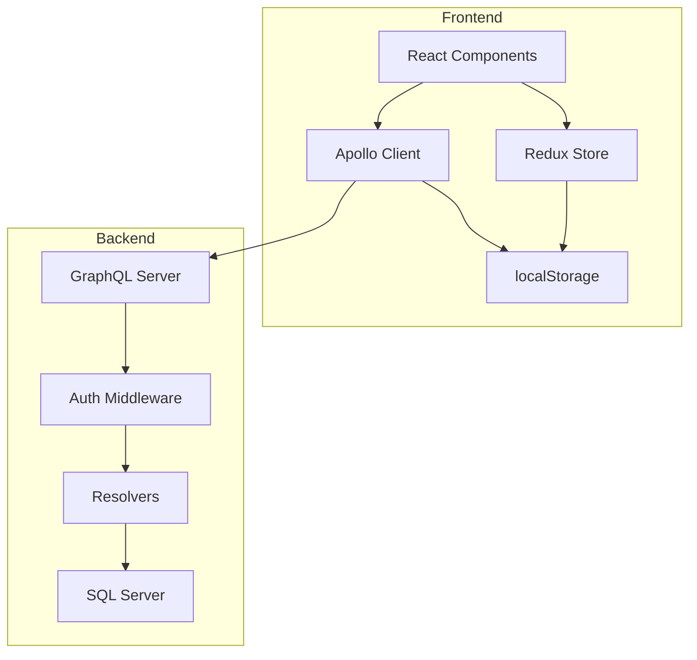

# Design Document: User Authentication

## Overview

The user authentication system is a full-stack TypeScript solution that provides secure user registration, login, and session management using JWT tokens. The architecture follows a clear separation between frontend (React + Redux + Apollo Client) and backend (Node.js + Express + GraphQL + SQL Server), with security as a primary concern.

The system uses bcrypt for password hashing, JWT for stateless authentication, and localStorage for token persistence. Protected routes and resolvers ensure that only authenticated users can access sensitive resources.

## Architecture

### High-Level Architecture



### Component Layers

1. **Presentation Layer** (React Components)
   - Login/Register forms
   - Protected route wrappers
   - Navigation based on auth state

2. **State Management Layer** (Redux)
   - Authentication state (user, tokens, loading, errors)
   - Async thunks for login/register/logout
   - Selectors for auth status

3. **API Layer** (Apollo Client)
   - GraphQL mutations and queries
   - Auth link for token injection
   - Error handling for auth failures

4. **Backend API Layer** (GraphQL Server)
   - Schema definitions for auth operations
   - Resolvers for mutations and queries
   - Context building with auth data

5. **Business Logic Layer** (Auth Services)
   - Password hashing and verification
   - JWT token generation and validation
   - User lookup and creation

6. **Data Layer** (SQL Server)
   - Users table with constraints
   - Database queries for CRUD operations

## Components and Interfaces

### Frontend Components

#### 1. Redux Auth Slice

```typescript
// Enums for auth states and error types
enum AuthStatus {
  IDLE = 'idle',
  LOADING = 'loading',
  AUTHENTICATED = 'authenticated',
  UNAUTHENTICATED = 'unauthenticated',
  ERROR = 'error',
}

enum AuthErrorType {
  INVALID_CREDENTIALS = 'INVALID_CREDENTIALS',
  EMAIL_EXISTS = 'EMAIL_EXISTS',
  NETWORK_ERROR = 'NETWORK_ERROR',
  TOKEN_EXPIRED = 'TOKEN_EXPIRED',
  VALIDATION_ERROR = 'VALIDATION_ERROR',
}

interface AuthError {
  type: AuthErrorType;
  message: string;
}

interface AuthState {
  user: User | null;
  accessToken: string | null;
  refreshToken: string | null;
  status: AuthStatus;
  isAuthenticated: boolean;
  loading: boolean;
  error: AuthError | null;
}

interface User {
  id: number;
  email: string;
  name: string;
}

// Async thunks with typed parameters
loginUser(credentials: LoginCredentials): AsyncThunk<User, LoginCredentials>
registerUser(data: RegisterData): AsyncThunk<User, RegisterData>
logoutUser(): AsyncThunk<void, void>
initializeAuth(): AsyncThunk<User | null, void>

// Reducers with typed payloads
setUser(user: User): void
setTokens(accessToken: string, refreshToken: string): void
clearAuth(): void
setError(error: AuthError): void
setStatus(status: AuthStatus): void

// Type definitions for thunk parameters
interface LoginCredentials {
  email: string;
  password: string;
}

interface RegisterData {
  email: string;
  password: string;
  name: string;
}
```

#### 2. Apollo Client Configuration

```typescript
// Enum for GraphQL error codes
enum GraphQLErrorCode {
  UNAUTHENTICATED = 'UNAUTHENTICATED',
  FORBIDDEN = 'FORBIDDEN',
  BAD_USER_INPUT = 'BAD_USER_INPUT',
  INTERNAL_SERVER_ERROR = 'INTERNAL_SERVER_ERROR',
}

interface AuthLink {
  // Adds Authorization header to requests
  setContext((
    _: unknown,
    { headers }: { headers: Record<string, string> }
  ): { headers: Record<string, string> } => {
    const token: string | null = getTokenFromStorage();
    return {
      headers: {
        ...headers,
        authorization: token ? `Bearer ${token}` : '',
      },
    };
  })
}

interface ErrorLink {
  // Handles authentication errors
  onError(({
    graphQLErrors,
    networkError,
  }: {
    graphQLErrors?: ReadonlyArray<GraphQLError>;
    networkError?: Error;
  }): void => {
    if (graphQLErrors && isAuthError(graphQLErrors)) {
      clearTokens();
      redirectToLogin();
    }
  })
}

// Type guard for authentication errors
function isAuthError(errors: ReadonlyArray<GraphQLError>): boolean {
  return errors.some(
    (error) => error.extensions?.code === GraphQLErrorCode.UNAUTHENTICATED
  );
}
```

#### 3. Protected Route Component

```typescript
interface ProtectedRouteProps {
  children: ReactNode;
}

function ProtectedRoute({ children }: ProtectedRouteProps): ReactElement {
  isAuthenticated = useSelector(selectIsAuthenticated)
  
  if (!isAuthenticated) {
    return <Navigate to="/login" />
  }
  
  return children
}
```

#### 4. Token Storage Service

```typescript
// Enum for storage keys
enum StorageKey {
  ACCESS_TOKEN = 'access_token',
  REFRESH_TOKEN = 'refresh_token',
  USER_DATA = 'user_data',
}

interface TokenStorage {
  saveTokens(accessToken: string, refreshToken: string): void;
  getAccessToken(): string | null;
  getRefreshToken(): string | null;
  clearTokens(): void;
  isTokenExpired(token: string): boolean;
}

// Implementation with proper type hints
class TokenStorageService implements TokenStorage {
  saveTokens(accessToken: string, refreshToken: string): void {
    localStorage.setItem(StorageKey.ACCESS_TOKEN, accessToken);
    localStorage.setItem(StorageKey.REFRESH_TOKEN, refreshToken);
  }

  getAccessToken(): string | null {
    return localStorage.getItem(StorageKey.ACCESS_TOKEN);
  }

  getRefreshToken(): string | null {
    return localStorage.getItem(StorageKey.REFRESH_TOKEN);
  }

  clearTokens(): void {
    localStorage.removeItem(StorageKey.ACCESS_TOKEN);
    localStorage.removeItem(StorageKey.REFRESH_TOKEN);
    localStorage.removeItem(StorageKey.USER_DATA);
  }

  isTokenExpired(token: string): boolean {
    try {
      const decoded = jwtDecode<{ exp: number }>(token);
      return decoded.exp < Date.now() / 1000;
    } catch {
      return true;
    }
  }
}
```

### Backend Components

#### 1. GraphQL Schema

```graphql
# Enums for error codes and user status
enum ErrorCode {
  UNAUTHENTICATED
  FORBIDDEN
  BAD_USER_INPUT
  INTERNAL_SERVER_ERROR
  EMAIL_EXISTS
  INVALID_CREDENTIALS
}

enum UserStatus {
  ACTIVE
  INACTIVE
  SUSPENDED
}

type User {
  id: ID!
  email: String!
  name: String!
  status: UserStatus!
  createdAt: String!
}

type AuthPayload {
  user: User!
  accessToken: String!
  refreshToken: String!
}

input RegisterInput {
  email: String!
  password: String!
  name: String!
}

input LoginInput {
  email: String!
  password: String!
}

type Query {
  me: User!
}

type Mutation {
  register(input: RegisterInput!): AuthPayload!
  login(input: LoginInput!): AuthPayload!
}
```

#### 2. Auth Service

```typescript
// Enums for token types and validation results
enum TokenType {
  ACCESS = 'ACCESS',
  REFRESH = 'REFRESH',
}

enum TokenValidationResult {
  VALID = 'VALID',
  EXPIRED = 'EXPIRED',
  INVALID = 'INVALID',
  MALFORMED = 'MALFORMED',
}

// Constants for configuration
const BCRYPT_SALT_ROUNDS = 10 as const;
const ACCESS_TOKEN_EXPIRY = '15m' as const;
const REFRESH_TOKEN_EXPIRY = '7d' as const;

interface JWTPayload {
  userId: number;
  type: TokenType;
  iat: number;
  exp: number;
}

interface TokenPair {
  accessToken: string;
  refreshToken: string;
}

interface TokenValidation {
  result: TokenValidationResult;
  payload: JWTPayload | null;
  error: string | null;
}

interface AuthService {
  hashPassword(password: string): Promise<string>;
  comparePassword(password: string, hash: string): Promise<boolean>;
  generateTokens(userId: number): TokenPair;
  verifyToken(token: string, type: TokenType): TokenValidation;
}

// Implementation with proper type hints
class AuthServiceImpl implements AuthService {
  async hashPassword(password: string): Promise<string> {
    return bcrypt.hash(password, BCRYPT_SALT_ROUNDS);
  }

  async comparePassword(password: string, hash: string): Promise<boolean> {
    return bcrypt.compare(password, hash);
  }

  generateTokens(userId: number): TokenPair {
    const accessToken: string = jwt.sign(
      { userId, type: TokenType.ACCESS },
      process.env.JWT_SECRET!,
      { expiresIn: ACCESS_TOKEN_EXPIRY }
    );
    
    const refreshToken: string = jwt.sign(
      { userId, type: TokenType.REFRESH },
      process.env.JWT_REFRESH_SECRET!,
      { expiresIn: REFRESH_TOKEN_EXPIRY }
    );
    
    return { accessToken, refreshToken };
  }

  verifyToken(token: string, type: TokenType): TokenValidation {
    try {
      const secret: string = type === TokenType.ACCESS
        ? process.env.JWT_SECRET!
        : process.env.JWT_REFRESH_SECRET!;
      
      const payload = jwt.verify(token, secret) as JWTPayload;
      
      if (payload.type !== type) {
        return {
          result: TokenValidationResult.INVALID,
          payload: null,
          error: 'Token type mismatch',
        };
      }
      
      return {
        result: TokenValidationResult.VALID,
        payload,
        error: null,
      };
    } catch (error) {
      if (error instanceof jwt.TokenExpiredError) {
        return {
          result: TokenValidationResult.EXPIRED,
          payload: null,
          error: 'Token expired',
        };
      }
      
      return {
        result: TokenValidationResult.INVALID,
        payload: null,
        error: 'Invalid token',
      };
    }
  }
}
```

#### 3. Auth Middleware

```typescript
interface AuthContext {
  userId: number | null;
  isAuthenticated: boolean;
}

function buildContext({ req }): AuthContext {
  token = extractTokenFromHeader(req.headers.authorization)
  
  if (!token) {
    return { userId: null, isAuthenticated: false }
  }
  
  payload = verifyToken(token)
  
  if (!payload) {
    return { userId: null, isAuthenticated: false }
  }
  
  return { userId: payload.userId, isAuthenticated: true }
}

function requireAuth(context: AuthContext): void {
  if (!context.isAuthenticated) {
    throw new AuthenticationError("Not authenticated")
  }
}
```

#### 4. User Repository

```typescript
// Enum for user status
enum UserStatus {
  ACTIVE = 'ACTIVE',
  INACTIVE = 'INACTIVE',
  SUSPENDED = 'SUSPENDED',
}

// Database user record (with password hash)
interface UserRecord {
  id: number;
  email: string;
  password: string; // hashed
  name: string;
  status: UserStatus;
  createdAt: Date;
  updatedAt: Date;
}

// Public user data (without password)
interface User {
  id: number;
  email: string;
  name: string;
  status: UserStatus;
  createdAt: Date;
}

// Input for creating a user
interface CreateUserInput {
  email: string;
  passwordHash: string;
  name: string;
  status?: UserStatus;
}

interface UserRepository {
  createUser(input: CreateUserInput): Promise<User>;
  findUserByEmail(email: string): Promise<UserRecord | null>;
  findUserById(id: number): Promise<UserRecord | null>;
  updateUserStatus(id: number, status: UserStatus): Promise<void>;
}

// Helper to strip password from user record
function toPublicUser(record: UserRecord): User {
  const { password, updatedAt, ...publicUser } = record;
  return publicUser;
}
```

#### 5. GraphQL Resolvers

```typescript
interface Resolvers {
  Query: {
    me(parent, args, context): Promise<User>
  }
  
  Mutation: {
    register(parent, { input }, context): Promise<AuthPayload>
    login(parent, { input }, context): Promise<AuthPayload>
  }
}

// Register resolver
async register(parent, { input }, context): Promise<AuthPayload> {
  // Validate input
  validateEmail(input.email)
  validatePassword(input.password)
  validateName(input.name)
  
  // Check if user exists
  existingUser = await userRepository.findUserByEmail(input.email)
  if (existingUser) {
    throw new Error("Email already registered")
  }
  
  // Hash password
  passwordHash = await authService.hashPassword(input.password)
  
  // Create user
  user = await userRepository.createUser(input.email, passwordHash, input.name)
  
  // Generate tokens
  tokens = authService.generateTokens(user.id)
  
  return {
    user: { id: user.id, email: user.email, name: user.name },
    accessToken: tokens.accessToken,
    refreshToken: tokens.refreshToken
  }
}

// Login resolver
async login(parent, { input }, context): Promise<AuthPayload> {
  // Find user
  user = await userRepository.findUserByEmail(input.email)
  if (!user) {
    throw new Error("Invalid credentials")
  }
  
  // Verify password
  isValid = await authService.comparePassword(input.password, user.password)
  if (!isValid) {
    throw new Error("Invalid credentials")
  }
  
  // Generate tokens
  tokens = authService.generateTokens(user.id)
  
  return {
    user: { id: user.id, email: user.email, name: user.name },
    accessToken: tokens.accessToken,
    refreshToken: tokens.refreshToken
  }
}

// Me resolver
async me(parent, args, context): Promise<User> {
  requireAuth(context)
  
  user = await userRepository.findUserById(context.userId)
  if (!user) {
    throw new Error("User not found")
  }
  
  return { id: user.id, email: user.email, name: user.name }
}
```

## Data Models

### Database Schema

#### Users Table

```sql
CREATE TABLE Users (
  id INT IDENTITY(1,1) PRIMARY KEY,
  email NVARCHAR(255) NOT NULL UNIQUE,
  password NVARCHAR(255) NOT NULL,
  name NVARCHAR(255) NOT NULL,
  createdAt DATETIME2 DEFAULT GETDATE()
);

CREATE INDEX idx_users_email ON Users(email);
```

### TypeScript Types

#### Frontend Types

```typescript
// Enums for type safety
enum AuthStatus {
  IDLE = 'idle',
  LOADING = 'loading',
  AUTHENTICATED = 'authenticated',
  UNAUTHENTICATED = 'unauthenticated',
  ERROR = 'error',
}

enum AuthErrorType {
  INVALID_CREDENTIALS = 'INVALID_CREDENTIALS',
  EMAIL_EXISTS = 'EMAIL_EXISTS',
  NETWORK_ERROR = 'NETWORK_ERROR',
  TOKEN_EXPIRED = 'TOKEN_EXPIRED',
  VALIDATION_ERROR = 'VALIDATION_ERROR',
}

enum UserStatus {
  ACTIVE = 'ACTIVE',
  INACTIVE = 'INACTIVE',
  SUSPENDED = 'SUSPENDED',
}

// User type (without password)
interface User {
  id: number;
  email: string;
  name: string;
  status: UserStatus;
}

// Auth error with type
interface AuthError {
  type: AuthErrorType;
  message: string;
  field?: string; // For validation errors
}

// Auth state
interface AuthState {
  user: User | null;
  accessToken: string | null;
  refreshToken: string | null;
  status: AuthStatus;
  isAuthenticated: boolean;
  loading: boolean;
  error: AuthError | null;
}

// Form inputs with validation
interface RegisterInput {
  email: string;
  password: string;
  name: string;
}

interface LoginInput {
  email: string;
  password: string;
}

// Validation result
interface ValidationResult {
  isValid: boolean;
  errors: Array<{ field: string; message: string }>;
}

// API responses
interface AuthPayload {
  user: User;
  accessToken: string;
  refreshToken: string;
}
```

#### Backend Types

```typescript
// Enums for backend
enum TokenType {
  ACCESS = 'ACCESS',
  REFRESH = 'REFRESH',
}

enum UserStatus {
  ACTIVE = 'ACTIVE',
  INACTIVE = 'INACTIVE',
  SUSPENDED = 'SUSPENDED',
}

enum ErrorCode {
  UNAUTHENTICATED = 'UNAUTHENTICATED',
  FORBIDDEN = 'FORBIDDEN',
  BAD_USER_INPUT = 'BAD_USER_INPUT',
  INTERNAL_SERVER_ERROR = 'INTERNAL_SERVER_ERROR',
  EMAIL_EXISTS = 'EMAIL_EXISTS',
  INVALID_CREDENTIALS = 'INVALID_CREDENTIALS',
}

// Database user (with password hash)
interface UserRecord {
  id: number;
  email: string;
  password: string; // bcrypt hash
  name: string;
  status: UserStatus;
  createdAt: Date;
  updatedAt: Date;
}

// JWT payload with type
interface JWTPayload {
  userId: number;
  type: TokenType;
  iat: number;
  exp: number;
}

// GraphQL context with user info
interface GraphQLContext {
  userId: number | null;
  isAuthenticated: boolean;
  userStatus: UserStatus | null;
}

// Validation error structure
interface ValidationError {
  field: string;
  message: string;
  code: string;
}

// Service result pattern for error handling
type Result<T, E = Error> = 
  | { success: true; data: T }
  | { success: false; error: E };
```


## Correctness Properties

A property is a characteristic or behavior that should hold true across all valid executions of a system—essentially, a formal statement about what the system should do. Properties serve as the bridge between human-readable specifications and machine-verifiable correctness guarantees.

### Authentication Flow Properties

**Property 1: Registration creates authenticated user**

*For any* valid registration input (email, password, name), registering a new user should create a database record with a hashed password and return an authentication response containing the user data and valid JWT tokens.

**Validates: Requirements 1.1, 1.5**

**Property 2: Invalid registration inputs are rejected**

*For any* invalid registration input (empty fields, malformed email, weak password), the registration attempt should be rejected with appropriate validation errors, and no user record should be created.

**Validates: Requirements 1.3**

**Property 3: Login with valid credentials returns tokens**

*For any* registered user, logging in with the correct email and password should return an authentication response containing the user data and valid JWT tokens.

**Validates: Requirements 2.1, 2.4**

**Property 4: Authentication response format consistency**

*For any* successful authentication operation (login or register), the response should contain a user object (id, email, name), an accessToken string, and a refreshToken string.

**Validates: Requirements 1.5, 2.4**

### Password Security Properties

**Property 5: Password hashing with bcrypt**

*For any* password, when hashed by the Auth_System, the result should be a valid bcrypt hash with 10 salt rounds, and the original password should never be stored or returned in plain text.

**Validates: Requirements 1.4, 9.1, 9.2**

**Property 6: Password verification round-trip**

*For any* password, hashing it and then verifying the original password against the hash using bcrypt comparison should return true, while verifying any different password should return false.

**Validates: Requirements 2.5, 9.3**

**Property 7: Password hashes never exposed**

*For any* API response from the Auth_System, the response should never contain password hash fields, ensuring password hashes remain internal to the system.

**Validates: Requirements 9.4**

### JWT Token Properties

**Property 8: Token generation includes required data**

*For any* user ID, generating JWT tokens should produce an access token and refresh token that both contain the user ID and have expiration times set (15 minutes for access, 7 days for refresh).

**Validates: Requirements 3.1**

**Property 9: Token validation round-trip**

*For any* user ID, generating a token for that user and then validating the token should extract the same user ID, while validating an expired, tampered, or malformed token should fail.

**Validates: Requirements 3.2, 3.5**

**Property 10: Token expiration enforcement**

*For any* JWT token, if the current time is past the token's expiration time, validation should fail and return an authentication error.

**Validates: Requirements 3.3**

### Protected Resource Properties

**Property 11: Protected resolvers require valid authentication**

*For any* protected GraphQL resolver (including the "me" query), calling it with a valid JWT token should succeed and return the expected data, while calling it without a token or with an invalid token should return an authentication error.

**Validates: Requirements 4.1, 4.4**

**Property 12: Me query returns correct user**

*For any* registered user, calling the "me" query with a valid token for that user should return the user's information (id, email, name) matching the token's user ID.

**Validates: Requirements 4.4**

### Frontend State Management Properties

**Property 13: Token storage round-trip**

*For any* valid JWT tokens (access and refresh), storing them in localStorage and then retrieving them should return the same token values, and clearing tokens should result in null values when retrieved.

**Validates: Requirements 5.1, 5.2**

**Property 14: Authentication errors clear tokens**

*For any* authentication error (expired token, invalid token, unauthorized access), the Auth_System should clear all tokens from localStorage and update the authentication state to unauthenticated.

**Validates: Requirements 5.4, 8.2**

**Property 15: Protected routes enforce authentication**

*For any* protected frontend route, accessing it with a valid token should render the route content, while accessing it without a token or with an expired token should redirect to the login page.

**Validates: Requirements 6.1, 6.4**

**Property 16: Redux state synchronization**

*For any* authentication state change (login, logout, token expiration, initialization), the Redux store should be updated to reflect the current authentication status, user data, and token availability.

**Validates: Requirements 7.1, 7.3, 7.4**

### Apollo Client Properties

**Property 17: Apollo client includes auth headers conditionally**

*For any* GraphQL request made through Apollo Client, if a valid token exists in storage, the request should include an "Authorization: Bearer <token>" header, and if no token exists, the request should not include an Authorization header.

**Validates: Requirements 8.1, 8.3**

**Property 18: Apollo client handles auth errors**

*For any* GraphQL request that returns an authentication error, Apollo Client should clear stored tokens, update Redux state to unauthenticated, and trigger appropriate error handling.

**Validates: Requirements 8.2**

### Database Properties

**Property 19: User persistence with required fields**

*For any* user registration, the database should contain a record with all required fields (id, email, password hash, name, createdAt), and the email should be unique across all users.

**Validates: Requirements 10.1, 10.4**

**Property 20: User retrieval by identifier**

*For any* registered user, querying the database by email or by ID should return the same user record with all fields intact.

**Validates: Requirements 10.2, 10.3**

**Property 21: Email uniqueness constraint**

*For any* attempt to create a user with an email that already exists in the database, the operation should fail with a unique constraint violation error.

**Validates: Requirements 10.4**

## Error Handling

### Backend Error Handling

1. **Validation Errors**
   - Invalid email format → Return "Invalid email format" error
   - Empty required fields → Return "Field X is required" error
   - Password too weak → Return "Password must meet requirements" error

2. **Authentication Errors**
   - Invalid credentials → Return "Invalid email or password" error (generic message for security)
   - Expired token → Return "Token expired" error with 401 status
   - Invalid token → Return "Invalid token" error with 401 status
   - Missing token → Return "Authentication required" error with 401 status

3. **Database Errors**
   - Duplicate email → Return "Email already registered" error
   - Connection errors → Return "Service temporarily unavailable" error
   - Query errors → Log error, return generic "An error occurred" message

4. **Server Errors**
   - Unexpected errors → Log full error, return generic "Internal server error" message
   - Never expose stack traces or sensitive information in responses

### Frontend Error Handling

1. **Network Errors**
   - Connection failed → Display "Unable to connect to server" message
   - Timeout → Display "Request timed out, please try again" message
   - Retry logic for transient failures

2. **Authentication Errors**
   - 401 responses → Clear tokens, redirect to login, display "Session expired" message
   - Invalid credentials → Display error message from server
   - Registration errors → Display validation errors inline on form

3. **Form Validation**
   - Client-side validation before submission
   - Display errors inline with form fields
   - Prevent submission until validation passes

4. **State Management Errors**
   - Redux action failures → Update error state, display user-friendly message
   - Apollo errors → Handle in error link, update auth state if needed
   - Graceful degradation when services unavailable

## Testing Strategy

### Coding Standards

All code must follow these best practices:

**1. Type Hinting (TypeScript Strict Mode)**
- All function parameters must have explicit types
- All function return types must be declared
- No implicit `any` types allowed
- Use type guards for runtime type checking
- Example:
  ```typescript
  // Good
  function hashPassword(password: string): Promise<string> {
    return bcrypt.hash(password, BCRYPT_SALT_ROUNDS);
  }
  
  // Bad
  function hashPassword(password) {
    return bcrypt.hash(password, 10);
  }
  ```

**2. Enums for String/Number Constants**
- Use enums instead of string literals for status values, error codes, etc.
- Use `const` enums for compile-time optimization when appropriate
- Example:
  ```typescript
  // Good
  enum AuthStatus {
    IDLE = 'idle',
    LOADING = 'loading',
    AUTHENTICATED = 'authenticated',
  }
  
  // Bad
  const status = 'loading'; // Magic string
  ```

**3. Array Type Annotations**
- Always use typed arrays: `Type[]` or `Array<Type>`
- Use readonly arrays when data shouldn't be mutated: `ReadonlyArray<Type>`
- Example:
  ```typescript
  // Good
  const users: User[] = [];
  const errors: ReadonlyArray<ValidationError> = [];
  
  // Bad
  const users = [];
  ```

**4. Linting and Formatting**
- ESLint with TypeScript rules enabled
- Prettier for consistent formatting
- Pre-commit hooks with Husky and lint-staged
- Configuration:
  ```json
  // .eslintrc.json
  {
    "extends": [
      "eslint:recommended",
      "plugin:@typescript-eslint/recommended",
      "plugin:@typescript-eslint/recommended-requiring-type-checking"
    ],
    "rules": {
      "@typescript-eslint/explicit-function-return-type": "error",
      "@typescript-eslint/no-explicit-any": "error",
      "@typescript-eslint/no-unused-vars": "error",
      "@typescript-eslint/strict-boolean-expressions": "error"
    }
  }
  ```

**5. Const Assertions**
- Use `as const` for literal values that shouldn't change
- Example:
  ```typescript
  const BCRYPT_SALT_ROUNDS = 10 as const;
  const ACCESS_TOKEN_EXPIRY = '15m' as const;
  ```

**6. Interface vs Type**
- Use `interface` for object shapes that may be extended
- Use `type` for unions, intersections, and utility types
- Example:
  ```typescript
  // Good - interface for extensible objects
  interface User {
    id: number;
    email: string;
  }
  
  // Good - type for unions
  type Result<T, E> = 
    | { success: true; data: T }
    | { success: false; error: E };
  ```

**7. Null Safety**
- Use strict null checks (`strictNullChecks: true`)
- Explicitly handle null/undefined cases
- Use optional chaining (`?.`) and nullish coalescing (`??`)
- Example:
  ```typescript
  function getUser(id: number): User | null {
    return users.find(u => u.id === id) ?? null;
  }
  
  const email = user?.email ?? 'unknown@example.com';
  ```

**8. Error Handling**
- Use typed errors with enums for error codes
- Never throw raw strings
- Always catch and handle errors appropriately
- Example:
  ```typescript
  class AuthenticationError extends Error {
    constructor(
      public code: ErrorCode,
      message: string
    ) {
      super(message);
      this.name = 'AuthenticationError';
    }
  }
  ```

### Dual Testing Approach

The authentication system requires both unit tests and property-based tests to ensure comprehensive coverage:

- **Unit tests**: Verify specific examples, edge cases, and error conditions
- **Property tests**: Verify universal properties across all inputs using randomized test data

Both testing approaches are complementary and necessary. Unit tests catch concrete bugs in specific scenarios, while property tests verify general correctness across a wide range of inputs.

### Property-Based Testing Configuration

**Library Selection:**
- **Frontend**: Use `fast-check` for property-based testing in TypeScript/JavaScript
- **Backend**: Use `fast-check` for property-based testing in Node.js/TypeScript

**Test Configuration:**
- Each property test must run a minimum of 100 iterations to ensure adequate coverage
- Each test must include a comment tag referencing the design document property
- Tag format: `// Feature: user-authentication, Property N: [property description]`
- Each correctness property must be implemented by a single property-based test

**Example Property Test Structure:**

```typescript
// Feature: user-authentication, Property 6: Password verification round-trip
test('password hashing and verification round-trip', () => {
  fc.assert(
    fc.asyncProperty(
      fc.string({ minLength: 8, maxLength: 100 }),
      async (password) => {
        const hash = await authService.hashPassword(password);
        const isValid = await authService.comparePassword(password, hash);
        expect(isValid).toBe(true);
        
        const isDifferentInvalid = await authService.comparePassword(
          password + 'wrong',
          hash
        );
        expect(isDifferentInvalid).toBe(false);
      }
    ),
    { numRuns: 100 }
  );
});
```

### Unit Testing Strategy

**Frontend Unit Tests:**
- Redux slice reducers and actions
- React component rendering and interactions
- Token storage service functions
- Protected route logic
- Form validation logic
- Apollo Client link behavior

**Backend Unit Tests:**
- GraphQL resolver logic
- Auth middleware context building
- Input validation functions
- Error handling paths
- Database query functions
- JWT token utilities

**Integration Tests:**
- End-to-end authentication flows (register → login → protected query)
- Token refresh flows
- Error recovery scenarios
- Database transaction handling

### Test Coverage Goals

- Minimum 80% code coverage for all modules
- 100% coverage for security-critical functions (password hashing, token validation)
- All error paths must have explicit tests
- All edge cases identified in requirements must have tests

### Testing Tools

- **Frontend**: Vitest, React Testing Library, fast-check
- **Backend**: Jest, Supertest, fast-check
- **Database**: In-memory SQL Server or test database
- **Mocking**: Mock Service Worker (MSW) for API mocking
